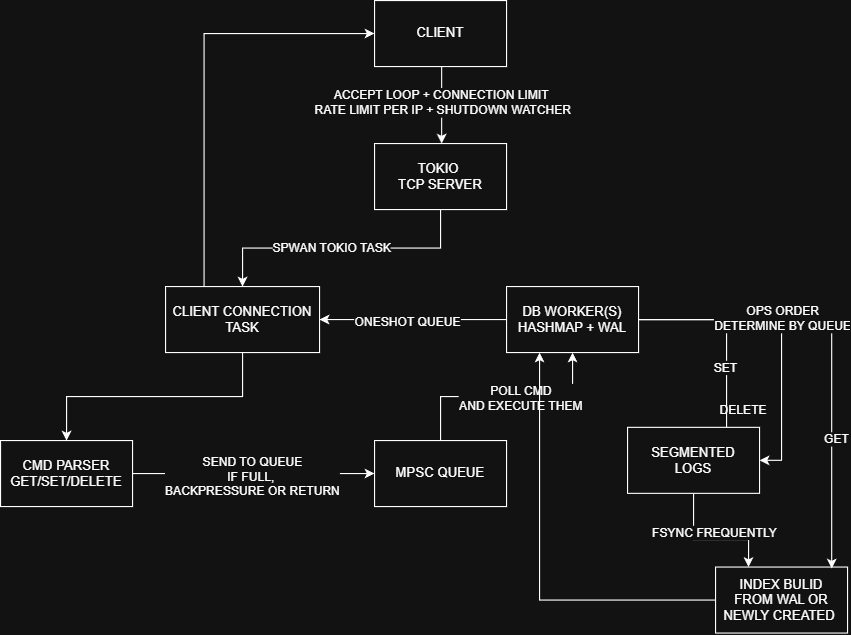

High-performance Async Write-Ahead Log DB

> Note: I AM BUILDING THIS PROJECT, BECAUSE I FUMBLED TO ANSWER INTERVIEW QUESTIONS ABOUT TOKIO, SO FUCK IT, I BALL!!!.

**High-level design**



**Network protocol**

- Request

```rust
#[repr(C)]
pub enum Operation {
    Get,
    Set,
    Delete,
}
```

GET/SET/DELETE = 0x00/0x01/0x02 -
`(1B op|4B key_length|4B value_length|key|value|)` (All are Little Endian)

- Response

```rust
#[repr(C)]
pub enum Response {
    Ok(Bytes),
    KeyValue(Bytes),
    KeyNotFound(Bytes),
    InvalidRequest(Bytes),
    PayloadTooLarge(Bytes),
    InternalError(Bytes),
}
```

OK/KeyValue/KeyNotFound/InvalidRequest/PayloadTooLarge/InternalError = 0x00/0x01/0x02/0x03/0x04/0x05 -
`(1B status|4B value_length|value|)` (All are Little Endian)

**TODO**

- Multiple DB workers (Sharding and Synchronization)
- Faster to memory index for read operations (Rwlock)
- Multiple segmented WALs
- Fsync infrequently and Group commits